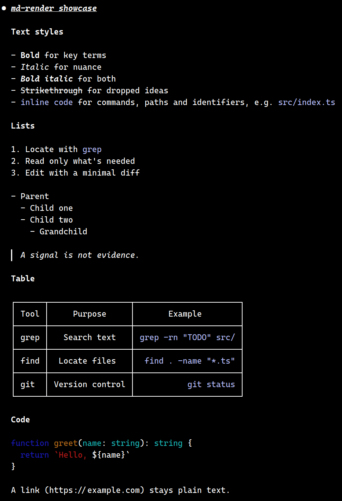
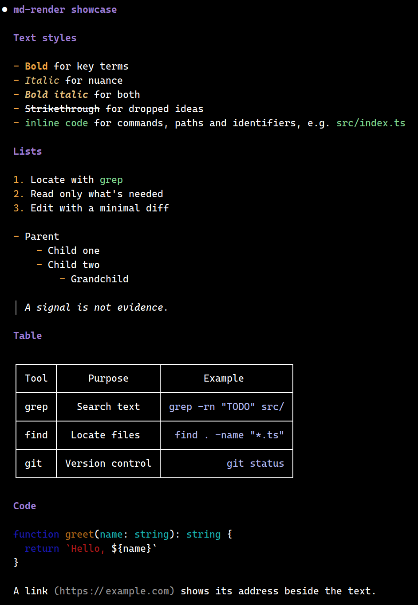

# md-render

Claude Code mod that redraws assistant messages as colored markdown.

<table width="100%">
  <tr>
    <th width="50%" align="center">Before</th>
    <th width="50%" align="center">After</th>
  </tr>
  <tr>
    <td width="50%" valign="top"></td>
    <td width="50%" valign="top"></td>
  </tr>
</table>

Both screenshots show the reply to "Print examples/showcase.md verbatim".

| Markdown | Rendering |
|---|---|
| `# Heading` | bold purple |
| `**bold**` | bold orange |
| `*italic*` | italic amber |
| `***bold italic***` | bold italic |
| `~~strike~~` | strikethrough |
| `` `code` `` | green |
| `- item`, `1. item` | orange markers, nested lists indented |
| `> quote` | dim `│` bar, italic text |
| fenced code, tables | drawn by Claude Code's own renderer (syntax highlighting, wrapping) |
| `[text](url)` | the text followed by the dim address |
| images, anything else | plain text |

Unclosed `**`, `` ` ``, `~~`, or a fence (mid-stream) stay plain text until they close.
If the message text can't be read or parsing throws, the default rendering is used.

The reply streams as plain text drawn by Claude Code and is restyled when the message completes.
A mod can't change the streamed text: `classic.MessageDisplay` is bypassed for user mods by `cc-plugin-sec-default`.

## Install

From a marketplace (this repo is one):

```
claude plugin marketplace add deepskyblue86/claude-markdown-mod
claude plugin install md-render@md-render-marketplace
```

Try it for one session without installing:

```
claude --plugin-dir /path/to/claude-markdown-mod
```

## Configure

Colors and the style mapping are in `CONFIG` at the top of `hooks/register.tsx`.
A style's `color` is a key of `CONFIG.colors` or a raw color.

## Develop

No build step: Claude Code loads `hooks/register.tsx` directly.

```
claude plugin validate .
claude plugin test .
```

`.claude-plugin/types/` is generated by Claude Code on load and is gitignored.

## License

MIT. See [LICENSE](LICENSE).
